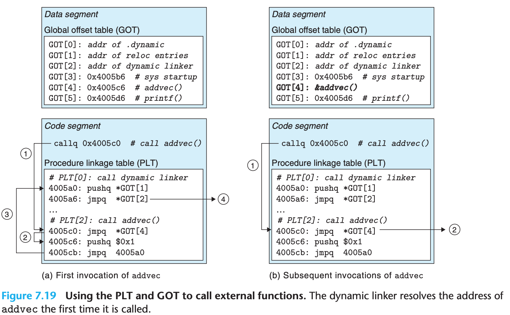

# GLIBC Source Code (v2.30)

- Dynamic linker: `elf/rtld.c`.
    - ELF's `.interp` section points to the dynamic linker, and here it is.
    - `dl_main()`: I guess this function is the entry point of the dynamic linker.
       Or maybe `dl_start()`. I don't know.
       Anyhow, the runtime virtual address of the dynamic linker is written into the `GOT[2]` slot,
       which is reserved for the dynamic linker.
    - Inside `dl_main()`, you can see how `LD_PRELOAD` is handled before the normal library scan.
- Start function name: `__libc_start_main`.
    - One thing I came across while building the ELF loader is the AUX array.
      It's an array setup by the kernel loader to pass some general information
      to the dynamic linker. It's implicitly setup in the original stack.

## Dynamic Linker

Most recent ELF produced by GCC is slightly different than
the ones described by previous textbook or papers.
The difference is small, though.

- When a program imports a certain function or variable, the linker
  will include a string with the function or variable’s name in the
  `.dynstr` section.
- A symbol (Elf Sym) that refers to the function or variable's name in the `.dynsym` section,
  and a relocation (Elf Rel) pointing to that symbol in the `.rela.plt` section.
- `.rela.dyn` and `.rela.plt` are for imported variables and functions, respectively.
- `.plt` is the normal one, it has instructions.
- `.got` and `.got.plt` maybe the first is for variable, and the latter is for function.
  But essentially the same global offset table functionality.

Relationship among `.dynstr`, `.dynsym`, `.rela.dyn` or `.rela.plt`. Credit: [link](https://www.usenix.org/system/files/conference/usenixsecurity15/sec15-paper-di-frederico.pdf):

PIC Lazy Binding. Credit: [link](https://uclibc.org/docs/psABI-x86_64.pdf):

Also that nowadays, even an non-PIC binary will always have GOT and PLT sections.
In theory, it probably should use load-time relocation. I suspect GOT and PLT are adopted
for the following 2 reasons:
a) load-time relocation needs to
modify code and this not good during time.
Especially considering code section probably is not writable.
b) GOT/PLT's lazy-binding has performance win at start-up time. However, keep in mind that
GOT/PLT's lazy-bindling pay extra runtime cost!

Reading:

- [System V Application Binary Interface](https://uclibc.org/docs/psABI-x86_64.pdf)
- [How the ELF Ruined Christmas](https://www.usenix.org/system/files/conference/usenixsecurity15/sec15-paper-di-frederico.pdf)
